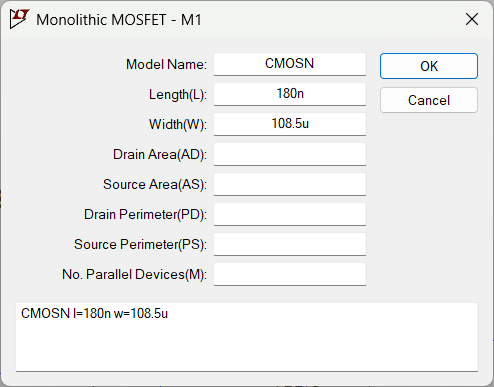

**Aim:**

**Design and analyse the differential amplifier for the following
specifications:**

**VDD=1.8V, P\<=2.2Mv, VICM=0.95V,
VOCM=1.1V, VP=0.4V**

**Perform DC Analysis , Transient Analysis, Frequency response and
extract the paramaters.**

**Differential Amplifier:**

Differential amplifiers consist of two transistors M1 and M2, whose
sources are joined together. If the two transistors are connected to
different voltage inputs, then the current across M1 and M2 are
different due to the gate voltage. If the voltage supply at the gate
terminal is the same, then the current through M1 and M2 is also the
same. This configuration is called "Common-Mode Input Voltage
Differential Amplifier". Whatever may be the load resistor, the MOSFET
M1 and M2 should not enter the Triode region. It should be verified that
the MOSFETs remain in the Saturation Region for proper operation.

Procedure : Make the circuit connection as given above. connect the
resister at the source terminal of both Mosfet now calculate the value
of ISS as power and VDD is given and calculate the
ID1 and ID2 now calculate the RSS and
RD

To find the all the values of resistor and current value. we need solve
the given question specification.

ISS =P/ VDD =2.2/1.8=1.22mA

ID1=ID2 = ISS/2=0.61mA

RD = VDD
-VOCM/ID1=1.8-1.1/0.61=1.145kΩ

RSS =Vp/ ISS =0.4/1.22=0.327kΩ

Finally by solving we get

ISS =0.909mA

ID1=ID2=0.61mA

RD =3.55kΩ

RSS =0.327kΩ

**Circuit-1**

Now to get the desired values of output voltage and current we have to
vary the width and length of both the Mosfet we got Length=180nm and
width=108.5um

**DC analysis:**

To perform the DC analysis we have to select the {DC op pnt} in the edit
simulation command and run the simulation the figure below is the values
obtained from the DC analysis 

Here in dc analysis we got the VOUT as expected and
ID1 and ID2 we got the same

**Transient analysis:**

To perform transient analysis we have to select the transient analysis
in the edit simulation and give the stop time as 5ms and run the
simulation . and the graph below shows the transient response of the
design. 

Voltage Gain AV=VOUTP-P /VINP-P

AV=(0.269V/50mV)

AV =5.38

**AC analysis:**

TO perform AC analysis we have to select the ac analysis in the edit
simulation command given the values as shown below ;

Gain in db= 20log(AV)

=20log(5.38)

=14.616

**Circuit-2:**

Now replace the RSS resister with a current source : connect
a current source of 1.22mA

**DC analysis:**

To perform the DC analysis we have to select the {DC op pnt} in the edit
simulation command and run the simulation the figure below is the values
obtained from the DC analysis

**Trasient analysis:**

To perform transient analysis we have to select the transient analysis
in the edit simulation and give the stop time as 5ms and run the
simulation . and the graph below shows the transient response of the
design

we have to give degree of 180deg to one Mosfet and 0deg to the other
Mosfet and ac amplitude 1 for one Mosfet and 0 for other Mosfet

Voltage Gain AV=VOUTP-P /VINP-P

AV=(1.33-0.870)/(0.999-0.900)

AV =4.64

**AC analysis:**

Gain in db= 20log(AV)

=20log(4.64)

=13.33

**Circuit-3:**

**DC analysis:**

Next, we need to calculate power, to make sure that the power is within
2.2 mW, to satisfy our power budget.

P = VDD.ISS = 1.8 V x 1.22226 mA = **2.200068
mW** *≈* 2.2 mW

Therefore, this fits our power budget, and we can proceed further. Next,
we can perform transient analysis, by applying ac input to any one of
the MOSFETs, and then calculating V/V gain, dB gain.

**Transient Analysis**

Apply a sinusoidal signal with DC offset = VG = 0.95 V,
Amplitude = 50 mV, Frequency = 1 kHz. In transient analysis, set stop
time to 5 ms. Place the .tran 5m directive anywhere on the schematic and
run the simulation.

We can calculate the V/V gain by dividing
Vout/Vin. Also, the output voltage curve (green)
appears inverted compared to the input voltage curve (blue) due to a
180° phase shift.

Av = Vout/Vin = 0.285/50 mV = **5.7
V/V**

Converting this to dB, we get A’v =
20log10(Av) = 20log10(5.7) = **15.117
dB**

Now, let us perform AC analysis and then verify our calculated results.

**AC analysis:**

As we can see, we get a midband gain of around **15.4 dB**, which is
close to the calculated value. We can also the 3 dB bandwidth at
around **2 GHz**. From the figure, we can see that the curve is not the
standard frequency response we are used to seeing. This may be due to
the effects of the NMOS behaving as a current source, which could
explain why a current source is used since it provides stability, and
prevents noise and fluctuation.

**INFERENCE:**

After performing this experiment, we learnt how the differential
amplifier operates, and how to build it in LTSpice. We see how the
differential amplifier rejects common mode signals, but amplifies
differential mode signals, making it the ideal building block for the
operational amplifier or the op-amp.

We also observed the three different configurations for the differential
amplifier, i.e., with resistance RSS, current source
ISS, the NMOS biased as a current source operating in
saturation region.

The highest gain we observed was in the NMOS configuration, which
provided a dB gain of 15.4 dB, compared to the other two configurations.
However, the frequency response for this configuration seems very
unstable, with constant fluctuations before the midband (possibly due to
the effects of the NMOS).

The advantage of the current source configuration is that we obtained
almost exact parameters that we had calculated for. It also provides a
more stable current ISS, since there won’t be any
fluctuations due to temperature, or any other reason. Lastly the
RSS configuration also seems reliable, but with increase in
temperature and tolerance errors, we may not get exact value of
resistance we calculated, which may decrease or increase our current
values, causing issue in power budget.

Overall, the differential amplifier is a very useful configuration,
since it measures the difference between the two drain voltages, thereby
preventing the effects of any noise. Another point to note is that the
differential amplifiers require two exactly matched N-channel MOSFETs,
making it easier to implement the circuit in LTSpice, using the 180 nm
TSMC .lib technology file.
